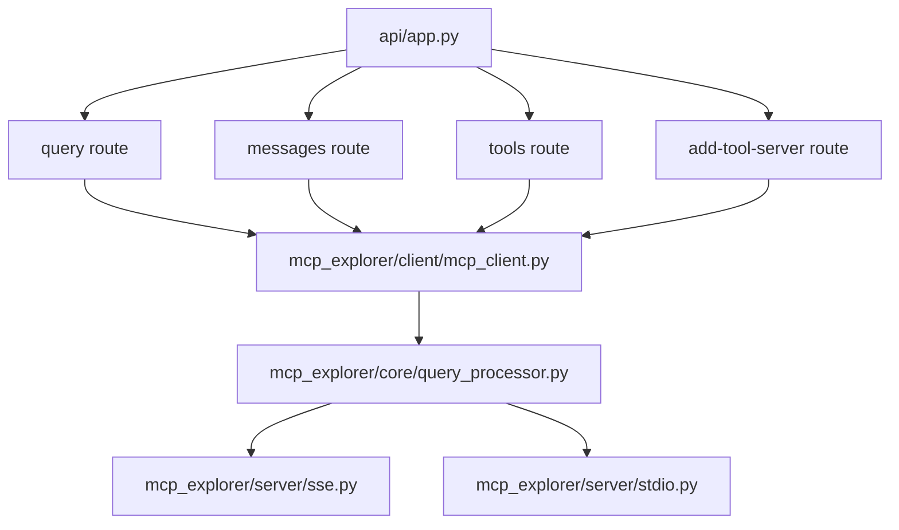

# MCP Explorer

An application to interact with the MCP protocol via an AI assistant (Claude) and external tools.

## Architecture Overview



## Project Layout

```text
mcp_explorer/
├─ api/
│  ├─ app.py
│  └─ routes/
│     ├─ query.py
│     ├─ messages.py
│     ├─ tools.py
│     └─ servers.py
├─ client/
│  └─ mcp_client.py
├─ core/
│  └─ query_processor.py
├─ server/
│  ├─ base.py
│  ├─ sse.py
│  └─ stdio.py
├─ config.py
├─ models.py
└─ static/
```

---

## CLI Usage
# Note: any relative paths in your config file (e.g. for `cmd:` entries or flags like `--directory`) are resolved
# relative to your current working directory (i.e. where you ran `mcp-explorer`).
# 
# Note: Interactive REPL mode requires the 'anthropic' and 'prompt_toolkit' packages (install via your environment or bundle).

```bash
# Start HTTP server + UI (default behavior)
mcp-explorer [--config <path>] [--verbose] [--port <port>]

# Interactive REPL chat client
mcp-explorer repl [--config <path>] [--verbose] [--port <port>]
```

## Frontend / SPA

The React single-page app is built into the Python package under `mcp_explorer/static`
and served at the root URL (`/`) by FastAPI. All back-end APIs live under `/api`,
so the UI makes relative requests (no CORS or hard-coded URLs needed).

### Development mode

```bash
cd frontend
npm install
# Point Vite dev proxy to your back-end port (default 8000)
export VITE_API_BASE_URL=http://localhost:9000
npm run dev
```

### Build for production

```bash
npm run build
```

This writes files into `mcp_explorer/static/`, which PyInstaller then bundles automatically.

## Build for OSx

```
pyinstaller --noconfirm --clean mcp-explorer.spec
```

### To package, sign, and notarize

I used this this tool, whih does all the steps in a nice package:

https://github.com/txoof/codesign

Note that I renamed it `pycodesign` when I downloaded it, even though it's called `pycodesign.py` when you download it from the repo.

```
cd dist
pycodesign ../pycodesign.ini
```

NB: Before you can notarize, you need to have a developer account with Apple and have set up the notarization process. This is a bit of a pain, but it's not too bad. You can find the instructions [here](https://developer.apple.com/documentation/security/notarizing_macos_software_before_distribution).

## Build for Docker

First, build the image:

```
docker build --no-cache  -t mcp-explorer -f mcp-explorer.Dockerfile .
```

Then run it -- you can use environment variables to pass in the commands you want to run:

````
docker run -it \
   -v $(pwd):/app \
   --env-file .env \
   mcp-explorer \
   mcp-explorer repl
```


## Retrieving the binary from the container

https://stackoverflow.com/questions/25292198/docker-how-can-i-copy-a-file-from-an-image-to-a-host

```
id=$(docker create mcp-explorer)
docker cp $id:/usr/local/bin/mcp-explorer ./dist/mcp-explorer.ubuntu
docker rm $id
```

This makes a file that you can then put somewhere so that it can be copied onto a machine.

# Testing STDIO client

This repo include a simple STDIO server that you can use to test the client:

````

python -u stdio-server.py

```
```

## Building the Python package

You can create a source distribution (`sdist`) and a wheel for publication on PyPI (and for local testing) using the standard PEP 517 build workflow:

```bash
python3 -m pip install --upgrade build
# Build both source archive and wheel into the `dist/` directory
python3 -m build --sdist --wheel
```

To test the newly built wheel in a fresh virtual environment:

```bash
python3 -m venv .venv-test
source .venv-test/bin/activate
pip install --upgrade pip
# Install your wheel (replace <version> with the actual version)
pip install dist/mcp_explorer-<version>-py3-none-any.whl
mcp-explorer --help
deactivate
```

When you're ready to publish to PyPI, use Twine:

```bash
pip install --upgrade twine
twine upload dist/*
```
